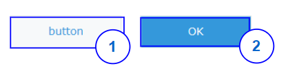

## Overview


|Number|	Description|
| --- | --- |
|1|	Normal button|	
|2|Submit button|

## Constructor
**Parameter**

| Name| Type| Required| Description |
| --- | --- | --- | --- |
|options|Object|No|The object contains params of constructor.|
|options.text|String|No|Text will be displayed in button.|
|options.type|String|No|Style of the button: <ul><li> 'normal' </li><li> 'submit' </li></ul> Default value: 'normal'|
|options.isDisabled|Boolean|No|The button will be disabled. <br> Default value: 'false'|
|options.isVisible|Boolean|No|The button will be visible. <br>  Default value: 'true'|

<!--DOCUSAURUS_CODE_TABS-->
<!--JavaScript-->
```js
var button = new kintoneUIComponent.Button({
    text: 'Submit',
    type: 'submit'
});
```
<!--ReactJS-->
```jsx
import { Button } from '@kintone/kintone-ui-component';
import React from 'react';
 
export default class Plugin extends React.Component {
    render() {
        return (
            <Button text='Submit' type='submit' isDisabled={false} isVisible={true} />
        );
    }
}
```

<!--END_DOCUSAURUS_CODE_TABS-->

## Methods
### render()
Get dom element of component.

**Parameter**

None

**Returns**

Dom element


<!--DOCUSAURUS_CODE_TABS-->
<!--JavaScript-->
```js
var button = new kintoneUIComponent.Button({text: 'button'});
var body = document.getElementsByTagName("BODY")[0];
body.appendChild(button.render());
```
<!--ReactJS-->
```jsx
import { Button } from '@kintone/kintone-ui-component';
import React from 'react';
 
export default class Plugin extends React.Component {
    render() {
        return (
            <Button text='Submit' type='submit' isDisabled={false} isVisible={true} />
        );
    }
}
```
<!--END_DOCUSAURUS_CODE_TABS-->

### setText(text)
Set displayed text in button.

**Parameter**

| Name| Type| Required| Description |
| --- | --- | --- | --- |
|text|	String|	Yes|Display text in button|

**Returns**

None

<!--DOCUSAURUS_CODE_TABS-->
<!--JavaScript-->
```js
var button = new kintoneUIComponent.Button({text: 'button'});
var body = document.getElementsByTagName("BODY")[0];
body.appendChild(button.render());
button.setText('submit');
```
<!--ReactJS-->
```jsx
import { Button } from '@kintone/kintone-ui-component';
import React from 'react';
 
export default class Plugin extends React.Component {
    render() {
        return (
            <Button text='Submit' type='normal' />
        );
    }
}
```
<!--END_DOCUSAURUS_CODE_TABS-->

### setType(type)
Set the displayed type for button.

**Parameter**

| Name| Type| Required| Description |
| --- | --- | --- | --- |
|type|String|No|Style of the button:<ul><li> 'normal' </li><li> 'submit' </li></ul> Default value: 'normal'|

**Returns**

None

<!--DOCUSAURUS_CODE_TABS-->
<!--JavaScript-->
```js
var button = new kintoneUIComponent.Button({text: 'button'});
var body = document.getElementsByTagName("BODY")[0];
body.appendChild(button.render());
button.setType('normal');
```
<!--ReactJS-->
```jsx
import { Button } from '@kintone/kintone-ui-component';
import React from 'react';
 
export default class Plugin extends React.Component {
    render() {
        return (
            <Button text='Submit' type='normal' />
        );
    }
}
```
<!--END_DOCUSAURUS_CODE_TABS-->

### on(eventName, callback)
Register callback for click event

**Parameter**

| Name| Type| Required| Description |
| --- | --- | --- | --- |
|eventName|	String|	Yes|Name of event: <ul><li>'click'</li></ul>|
|callback|function |Yes|callback|

**Returns**

None


<!--DOCUSAURUS_CODE_TABS-->
<!--JavaScript-->
```js
var button = new kintoneUIComponent.Button({text: 'button'});
var body = document.getElementsByTagName("BODY")[0];
body.appendChild(button.render());
button.on('click', function(event) {
    console.log('on click');
});
```
<!--ReactJS-->
```jsx
import { Button } from '@kintone/kintone-ui-component';
import React from 'react';
 
export default class Plugin extends React.Component {
    render() {
        return (
            <Button onClick={this.handleButtonClick} />
        );
    }
 
    handleButtonClick(event) {
        console.log('on click');
    }
}
```
<!--END_DOCUSAURUS_CODE_TABS-->

### show()
Display button.

**Parameter**

None

**Returns**

None


<!--DOCUSAURUS_CODE_TABS-->
<!--JavaScript-->
```js
var button = new kintoneUIComponent.Button({text: 'button'});
var body = document.getElementsByTagName("BODY")[0];
body.appendChild(button.render());
button.show();
```
<!--ReactJS-->
```jsx
import { Button } from '@kintone/kintone-ui-component';
import React from 'react';
 
export default class Plugin extends React.Component {
    render() {
        return (
            <Button text="button" isVisible={true} />
        );
    }
}
```
<!--END_DOCUSAURUS_CODE_TABS-->

### hide()
Hide button.

**Parameter**

None

**Returns**

None


<!--DOCUSAURUS_CODE_TABS-->
<!--JavaScript-->
```js
var button = new kintoneUIComponent.Button({text: 'button'});
var body = document.getElementsByTagName("BODY")[0];
body.appendChild(button.render());
button.hide();
```
<!--ReactJS-->
```jsx
import { Button } from '@kintone/kintone-ui-component';
import React from 'react';
 
export default class Plugin extends React.Component {
    render() {
        return (
            <Button text="button" isVisible={false} />
        );
    }
}
```
<!--END_DOCUSAURUS_CODE_TABS-->

### disable()
Disable button.

**Parameter**

None

**Returns**

None

<!--DOCUSAURUS_CODE_TABS-->
<!--JavaScript-->
```js
var button = new kintoneUIComponent.Button({text: 'button'});
var body = document.getElementsByTagName("BODY")[0];
body.appendChild(button.render());
button.disable();
```
<!--ReactJS-->
```jsx
import { Button } from '@kintone/kintone-ui-component';
import React from 'react';
 
export default class Plugin extends React.Component {
    render() {
        return (
            <Button text="button" isDisabled={true} />
        );
    }
}
```
<!--END_DOCUSAURUS_CODE_TABS-->

### enable()
Enable button.

**Parameter**

None

**Returns**

None


<!--DOCUSAURUS_CODE_TABS-->
<!--JavaScript-->
```js
var button = new kintoneUIComponent.Button({text: 'button'});
var body = document.getElementsByTagName("BODY")[0];
body.appendChild(button.render());
button.enable();
```
<!--ReactJS-->
```jsx
import { Button } from '@kintone/kintone-ui-component';
import React from 'react';
 
export default class Plugin extends React.Component {
    render() {
        return (
            <Button text="button" isDisabled={false} />
        );
    }
}
```
<!--END_DOCUSAURUS_CODE_TABS-->